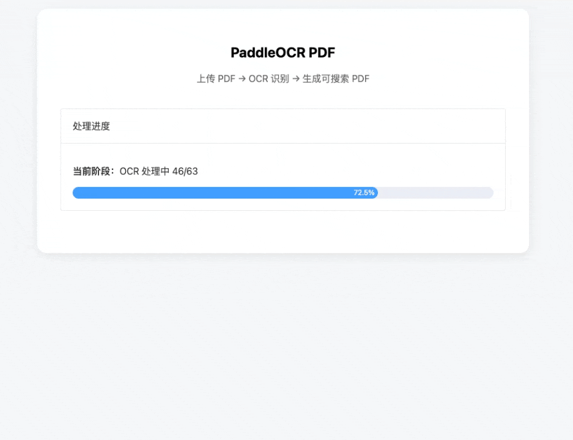

# 基于 PaddleOCR 的高性能可搜索 PDF 生成服务：99% 还原 PDF 页面实战

## 1. 引言
在数字化办公场景中，将扫描件或纯图片 PDF 转换为“可搜索、可选择、可复制”的 PDF 是一项刚需。本文将分享一个基于 **PaddleOCR** 和 **FastAPI** 开发的高性能 PDF OCR 服务。该项目通过**多线程并行处理**、**99% 还原 PDF 页面**的渲染算法和二分字号匹配技术，实现了生产级的处理速度与视觉还原精度。


---

## 2. 核心亮点
*   **🚀 GPU 多线程加速**：利用 `ThreadPoolExecutor` 实现页面级的并行 OCR，配合 GPU 加速，极大提升了大文件处理速度。
*   **🎯 99% 页面还原**：采用 2 倍缩放因子 (`ZOOM_FACTOR = 2.0`) 和 DPI 对齐技术，确保生成的 PDF 页面与原图 99% 一致。
*   **📐 精准渲染对齐**：二分搜索算法自动匹配最佳字号，配合 `px_to_pt` 坐标转换，透明文本层与原图文字完美重合。
*   **📊 实时进度追踪**：通过 SSE（Server-Sent Events）技术，在前端实时展示“渲染-识别-合并”的全流程百分比进度。
*   **🐳 Docker 一键部署**：完整集成环境配置，支持在容器内快速启动服务。
*   **💾 断点续传机制**：自动保存每页的 OCR 结果为 JSON，支持异常中断后的快速恢复。

---

## 3. 技术架构
*   **后端**: FastAPI (Python 3.10+)
*   **OCR 引擎**: PaddleOCR (PP-OCRv5 server 系列模型)
*   **PDF 处理**: PyMuPDF (fitz) + ReportLab
*   **前端**: Vue 3 + Element Plus

---

## 4. 99% 还原 PDF 页面的核心技术

### 4.1 DPI 与缩放因子对齐
为了实现 99% 的页面还原度，我们严格对齐了渲染参数：
```python
# 关键配置参数
IMG_DPI = 150          # 输入图像 DPI
PDF_DPI = 150          # 输出 PDF DPI
PT_PER_INCH = 72       # PDF 点每英寸
ZOOM_FACTOR = 2.0      # 2 倍缩放确保高精度
SCALE = 3              # 字体适配缩放系数

# 坐标转换：像素 -> PDF 点
pdf_width_pt = img_w_zoom * PT_PER_INCH / PDF_DPI
pdf_height_pt = img_h_zoom * PT_PER_INCH / PDF_DPI
```

### 4.2 高精度字号匹配逻辑
为了让 PDF 中的文字能够精准覆盖在原图上方，我们实现了基于 PIL 的字号二分搜索算法：
```python
def fit_font_size(text, target_w_px, target_h_px):
    lo, hi = 1, 2000
    best = 12
    target_w = target_w_px * PT_PER_INCH / PDF_DPI * SCALE
    target_h = target_h_px * PT_PER_INCH / PDF_DPI * SCALE
    for _ in range(25):
        mid = (lo + hi) // 2
        font = get_font(mid)
        tw, th = get_text_size(text, font)
        # 允许一定误差，确保文字能填满识别框
        if tw <= target_w + 10 and th <= target_h + 10:
            best, lo = mid, mid + 1
        else:
            hi = mid
    return max(6, best // SCALE)
```

### 4.3 页面渲染流程
```python
def process_page(args_tuple):
    # 1. 读取原图并 2 倍缩放
    orig_img = cv2.imread(img_path)
    img_h, img_w = orig_img.shape[:2]
    img_w_zoom = int(img_w * ZOOM_FACTOR)
    img_h_zoom = int(img_h * ZOOM_FACTOR)
    
    # 2. 计算 PDF 页面尺寸
    pdf_width_pt = img_w_zoom * PT_PER_INCH / PDF_DPI
    pdf_height_pt = img_h_zoom * PT_PER_INCH / PDF_DPI
    
    # 3. 绘制背景（原图或白色）
    if TEXT_VISIBLE:
        img_zoom = cv2.resize(orig_img, (img_w_zoom, img_h_zoom), 
                              interpolation=cv2.INTER_LANCZOS4)
        c.drawImage(ImageReader(img_pil), 0, 0, 
                    width=pdf_width_pt, height=pdf_height_pt)
    
    # 4. 绘制透明文本层
    for text, poly in zip(texts, polys):
        box = np.array(poly, dtype=np.float32).reshape(4, 2) * ZOOM_FACTOR
        # ... 字体计算与绘制
```

---

## 5. 多线程 GPU 加速

### 5.1 全局 OCR 实例共享
多线程模式下，OCR 模型只需加载一次到 GPU 显存，所有线程共享：
```python
OCR_INSTANCE = None

def get_ocr_instance():
    """获取全局 OCR 实例，多线程共享（GPU 友好）"""
    global OCR_INSTANCE
    if OCR_INSTANCE is None:
        OCR_INSTANCE = init_ocr()
    return OCR_INSTANCE

def init_ocr():
    device = get_device()  # 自动检测 GPU
    return PaddleOCR(
        text_detection_model_name="PP-OCRv5_server_det",
        text_recognition_model_name="PP-OCRv5_server_rec",
        device=device  # gpu:0 或 cpu
    )
```

### 5.2 线程池并发处理
```python
with ThreadPoolExecutor(max_workers=4) as executor:
    future_to_idx = {executor.submit(process_page, t): i 
                     for i, t in enumerate(tasks)}
    for future in as_completed(future_to_idx):
        page_pdfs[idx] = future.result()
```

---

## 6. Web 服务集成

### 6.1 FastAPI 后端
```python
@app.post("/api/ocr")
async def ocr(file: UploadFile, visible: bool = Form(True)):
    tid = str(uuid.uuid4())
    # 保存上传文件
    with open(pdf_path, "wb") as f:
        f.write(await file.read())
    # 启动 OCR 子进程
    subprocess.Popen([
        "python", "pdf_ocr_select.py",
        "--pdf", pdf_path,
        "--out", out_path,
        "--task_id", tid,
        "--visible" if visible else ""
    ])
    return {"task_id": tid}
```

### 6.2 SSE 实时进度推送
```python
@app.get("/api/sse/{tid}")
def sse(tid: str):
    def event_generator():
        while True:
            with open(progress_file) as f:
                data = json.load(f)
            yield f"data: {json.dumps(data)}\n\n"
            if data.get("done"):
                break
            time.sleep(0.4)
    return StreamingResponse(event_generator(), media_type="text/event-stream")
```

### 6.3 Vue 3 前端
```html
<el-checkbox v-model="isVisible" 
             label="生成带原图背景的可搜索 PDF" />
<el-upload :auto-upload="false" 
           accept=".pdf"
           :on-change="handleFileChange">
  <el-button type="primary">选择 PDF 文件</el-button>
</el-upload>
<el-progress :percentage="percent" 
             :stroke-width="20"
             text-inside />
```

---

## 7. 环境安装与部署

### 7.1 本地环境安装 (Ubuntu/Conda)

#### 方式一：系统 Python 安装
```bash
sudo apt update
sudo apt install -y \
  python3.10 \
  python3.10-venv \
  python3.10-dev \
  python3.10-distutils \
  python3-pip
```

#### 方式二：Conda 环境（推荐）
```bash
conda create --name paddle python==3.10
conda activate paddle
```

#### 安装 PaddlePaddle（GPU版）
适用于拥有 NVIDIA GPU 的用户：
```bash
python -m pip install paddlepaddle-gpu==3.2.0 \
  -i https://www.paddlepaddle.org.cn/packages/stable/cu118/
```

#### 安装 PaddlePaddle（CPU版）
适用于无 GPU 或仅使用 CPU 的用户：
```bash
python -m pip install paddlepaddle==3.2.0 -i https://www.paddlepaddle.org.cn/packages/stable/cpu/
```

#### 安装其他依赖
```bash
pip install fastapi uvicorn python-multipart pymupdf paddleocr==3.2.0 reportlab logging beautifulsoup4
```

#### GPU 环境验证（仅 GPU 用户）
```bash
nvidia-smi
nvcc --version
```

**请以您自己的输出为准**：
```
[此处应显示您本地的 nvidia-smi 和 nvcc --version 输出]
```

### 7.2 Docker 部署

#### 启动容器
```bash
docker run --name paddle_ocr_service \
  -itd \
  -v $PWD:/paddle \
  -p 8038:8038 \
  ccr-2vdh3abv-pub.cnc.bj.baidubce.com/paddlepaddle/paddle:3.2.0 \
  /bin/bash
```

#### 安装依赖与启动
```bash
cd /paddle
pip install fastapi uvicorn python-multipart pymupdf paddleocr==3.2.0 reportlab logging beautifulsoup4
python main.py
```
访问 `http://localhost:8038` 即可使用。

---

## 8. 使用指南
1.  **上传 PDF**：点击按钮选择需要处理的文件。
2.  **配置选项**：勾选“生成带原图背景的可搜索 PDF”以获得 99% 还原效果。
3.  **监控进度**：实时查看“渲染 → OCR 识别 → PDF 合并”各阶段进度。
4.  **下载结果**：处理完成后下载可搜索 PDF。

---

## 9. 结语
本项目通过 **DPI 对齐**、**2 倍缩放**、**二分字号匹配** 三大技术，实现了 PDF 页面的 99% 还原。结合 **GPU 多线程加速**，既保证了视觉一致性，又大幅提升了处理速度。


## 微信公众号 

希望这篇实战分享能对你有所帮助！如有疑问欢迎在评论区讨论。